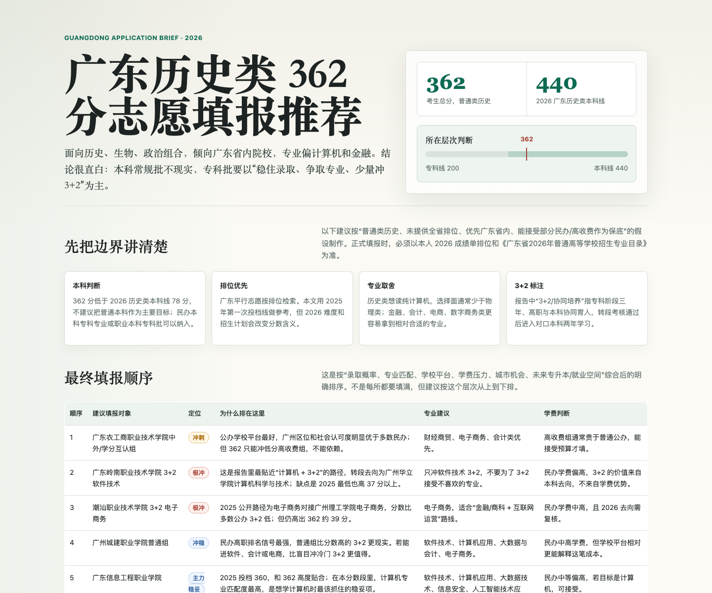

# gaokao-volunteer-html

中国高考志愿填报 HTML 报告 Skill。它面向“某省某分数怎么报”“专科/本科/3+2 推荐”“帮我生成 HTML 志愿报告”等场景，强调先问清关键信息，再基于官方和公开资料生成可执行的志愿排序报告。



## 能做什么

- 先向用户索要必要信息，避免只凭分数盲目推荐。
- 核验省控线、近年投档线、招生计划、学费、学校地址、校区和办学性质。
- 对 3+2 / 三二分段项目写清楚“专科专业 → 对口本科院校 → 本科专业”。
- 输出单文件中文 HTML 报告，适合打印、分享和手机查看。
- 给出明确的从上到下填报顺序，而不是只罗列学校。

## 必问信息

调用这个 Skill 时，如果信息不完整，它会先问用户：

1. 高考省份和年份。
2. 总分和全省排位。
3. 科类或选科组合。
4. 批次目标：本科、专科、提前批、3+2 等。
5. 地域偏好。
6. 专业偏好和不能接受的专业。
7. 学费预算，以及是否接受民办、中外合作、校企合作、学分互认、国际班。
8. 更重视录取稳、专业好、学校名气、城市、升学还是就业。

## 报告结构

生成的 HTML 报告通常包含：

- 结论首屏
- 假设与边界
- 最终填报顺序
- 院校专业组推荐
- 3+2 / 三二分段专区
- 学校画像与排名对比
- 学费与性价比
- 专业横向比较
- 填报操作建议
- 资料来源

## 安装

把仓库中的 `SKILL.md` 放到 Codex skills 目录：

```bash
mkdir -p ~/.codex/skills/gaokao-volunteer-html
cp SKILL.md ~/.codex/skills/gaokao-volunteer-html/SKILL.md
```

重新打开 Codex 后即可使用。

## 示例触发

```text
帮我做一份广东 2026 高考志愿填报 HTML 报告。历史类 362 分，想报广东省内，专业偏计算机和金融，重点看看 3+2。
```

如果用户没有给排位和预算，Skill 会先追问，不会直接开始生成。

## 数据原则

- 高考政策和分数线优先使用省教育考试院、省招生办、阳光高考平台。
- 学校信息优先使用学校官网、招生网和招生章程。
- 排名只作为参考，必须标注为第三方榜单，不能当作录取依据。
- 无法核验的信息必须标注“以当年招生专业目录和志愿填报系统为准”。

## 免责声明

本 Skill 生成的是志愿填报辅助分析，不替代官方志愿填报系统校验，也不构成录取承诺。正式填报时必须以当年招生专业目录、省考试院系统和学校招生章程为准。
